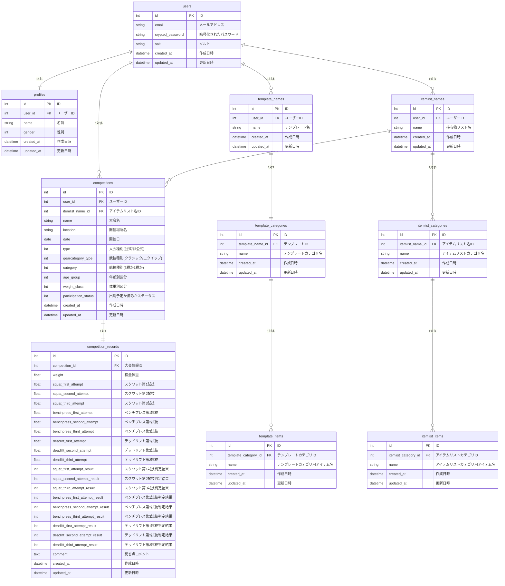

# ■サービス名(仮)

Good Lifter Log(仮)

### ■サービス概要
パワーリフティング大会、シングルベンチプレス大会に出場後、自分の試合結果を記録して
管理ができるサービスです。過去の試合の成績をグラフ化して成績の伸びがわかります。
競技へのモチベーション向上に役立てることができます。

### ■このサービスへの思い・作りたい理由
わたしは競技「パワーリフティング」をしています。
「パワーリフティング」とは体を鍛える基本3種目（BIG3)を競技にしたものです。
スクワット、ベンチプレス、デッドリフトの3種目(BIG3)の合計挙上重量を競います。
毎年2~3回の大会に出場しています。

抱えている課題1つ目: 結果を記録をするツールが無いこと。

私もそうですが、選手たちはSNS(X,インスタ）への投稿、紙、携帯のメモ帳ツールなどで記録をしています。
過去の記録を確認したい時、今までの大会成績の記録の伸びをみたい時、検索がし辛いと感じています。
今大会の成績と前大会の成績を比較し、プラスマイナス何kg上がったか、下がったかを毎回手動計算して確認していました。
今大会の入力した結果と、前大会の結果を比較し自動計算して表示してくれたら楽だと感じています。

抱えている課題2つ目: 持参する持ち物・食べ物リストを管理したい

手首の関節や膝関節を保護するサポーター、トレーニングベルト、競技用コスチューム、滑り止め、靴など持ち物が多いです
試合中の栄養補給のための食糧、ドリンクも必要です。
試合中の忘れ物や、あれが欲しかったなあ、など持ち物に対する反省がよくあります。
用意したけれど試合中だと食べにくいもの、スルスル食べやすくエネルギーが出るもの。
飲み物ならどのスポーツドリンクなら力が出やすいか、どれだけ用意すれば最後までエネルギー切れなく試合をこなせるか。
持ち物・食べ物に対する反省点を今まではノートにかいていましたが、検索性が悪くすぐに情報が引き出せません。

「パワーリフティング」の大会の成績と、気づきや反省点の記録、持ち物・食べ物リストを管理できる
アプリの開発をしようと思いました。

### ■ ユーザー層について
- パワーリフティング、シングルベンチプレスの競技者
	(シングルベンチプレスとはベンチプレスの挙上重量のみで競技する大会です。)

### ■サービスの利用イメージ
- 出場した大会の大会名、試合成績を記録できる
	- 得られる価値
		- 今大会の成績と前大会の成績を比較し、プラスマイナス何kg上がったか（下がったか）自動表示
		- 試合成績を一覧表示(大会名、出場年で絞り込み検索可)
		- 試合成績の伸びをグラフで見れてモチベーション向上につながる

- 持参する持ち物・食べ物リストを管理できる
	- 得られる価値
		- 次の大会で、何を準備すれば良いか思い出し迷う時間がなくなる
- 持ち物リストの利用イメージ
	- 持参する持ち物・食べ物リスト作成・管理機能
		- テンプレート作成
			- 荷物のカテゴリ毎にテンプレートを作成できる
				例えば
				- 試合で身につける物(サポーター、ベルト、試合用コスチューム）
				- ケアグッズ（ウォーミングアップで使用するヨガマット、マッサージ器具）
				- 飲食物（サプリ、食べ物、飲み物の量）
				- 遠征用宿泊グッズ
			- デフォルトで初期データを用意。ユーザーは自分で編集・削除が可能
			- カテゴリと名前でテンプレートの検索を可能にする
		
		- 持ち物リスト作成
			- 持ち物リスト作成方法
				- 作成したテンプレートを組み合わせして作成できる。
				- 持ち物リストにはカテゴリ,名前をつけることができる。
				- カテゴリ,名前で検索を可能にする
				- 例
					カテゴリ: 遠征あり 名前: パワーリフティング全国大会用リスト
					カテゴリ: 遠征なし 名前: シングルベンチ東京都大会リスト
				
			- 出場予定の大会を登録したあと、予め作成していた持ち物リストを大会名と紐づけて登録可。
				- 予め作成していた持ち物リストの中から、今回の出場予定の大会の条件に近いリストを選択。
				- 選択したリストを出場大会用に更に編集してカスタマイズ可能にする。
				
		- 持ち物リストの検索方法
			- テンプレートから作成した持ち物リスト一覧表からカテゴリ,名前で検索
			- 過去大会の持ち物リストを、年度、大会名、から検索
	
### ■ ユーザーの獲得について
X,インスタグラムでの告知。ジムで告知させてもらう。

### ■ サービスの差別化ポイント・推しポイント
- サービスの差別化ポイント
	- SNS(x,インスタ),その他メモ帳(デジタル、手書き）などの記録との差別化ポイント
		- 検索性が高い
		- 自動で前大会の重量比較ができる（SNS投稿時は手動)
		- 成績のグラフ化

### ■ 機能候補
- MVPリリース時 (メインは大会結果を記録したいなので記録のみ)
	- 会員登録機能
	- ログイン機能
	- プロフィール機能
	- 大会結果記録機能
		- 大会名
		- 場所（開催地、開催場所）
		- 日付
		- 大会種別１(公式大会または非公式大会)
		- 競技種別２(クラシックまたはエクイップ）
		- 競技種別(パワーリフティング、シングルベンチか)
		- カテゴリ(一般、サブジュニア、ジュニア、など年齢カテゴリ)
		- 階級(47kg級、52kg級など）
		- 検量体重
		- スクワット 挙上重量
		- ベンチプレス 挙上重量
		- デッドリフト 挙上重量
		- 3種目の合計挙上重量
		- 順位
		- 反省点コメント
	- 大会結果の編集・削除	
	- 大会結果一覧表示
	- 大会結果詳細表示

- 本リリース時
	- SNSシェア用の文章を作成（X用、インスタ用を想定）
	- 大会の試技動画を紐付け管理(仮、料金面確認後)
	- 持参する持ち物・食べ物リスト作成・管理機能
	- 成績のグラフ化
	- 出場予定の大会を登録機能
		- 場所 
		- 日付
		- 持ち物・食べ物リストを大会予定に紐づけて登録
	- LINE通知機能
		- 出場予定の大会を日付付きで登録
		- 大会が近づくと持ち物・食べ物リストに買いてあるものを準備するように促す通知
		- 大会が終わったら記録しましょうとユーザーに促す通知

### ■ 機能の実装方針予定
- 大会結果記録機能: 入力項目が多いためステップ入力・確認画面でユーザビリティ向上
- グラフ化機能: chart.jsまたはchartkick使用
- LINE通知機能: LINE Messaging API

| カテゴリ | 技術 |
| --- | --- |
| 開発環境 | Docker |
| フロントエンド | Bootstrap または TailwindCSS, Hotwire |
| バックエンド | Ruby 3.2.2 / Ruby on Rails 7系 |
| データベース | PostgreSQL,  |
| インフラ | Render |
| Web API | LINE Messaging API |
| その他 | AWS S3 (動画投稿機能追加時に使用検討） |

### ■ 画面遷移図
[Figma: 画面遷移図](https://www.figma.com/file/pGxlFmkWvjxv384P6Ymi9x/Good-Lifter-log?type=design&node-id=0%3A1&mode=design&t=7WateIMFCpHj8mR9-1)

### ■ ER図

