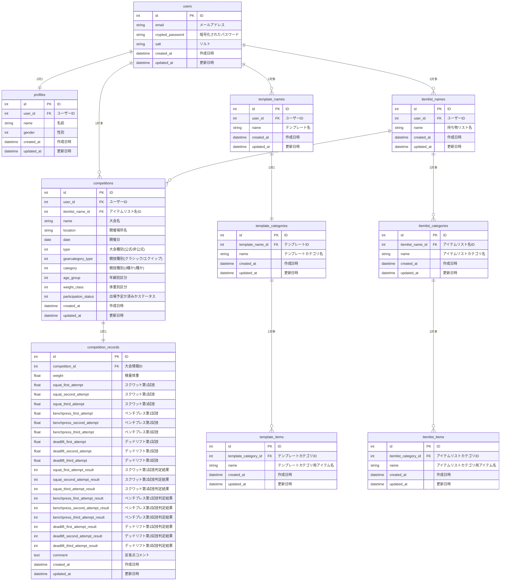

# PowerLifter's Log
## サービスURL： https://www.powerlifterslog.com/

### ■サービス概要
このサービスは、パワーリフティング大会やシングルベンチプレス大会の成績を登録・管理できるツールです。
パワーリフティングは、スクワット、ベンチプレス、デッドリフトの3種目の合計挙上重量で順位を決定する競技です。
シングルベンチプレス大会は、ベンチプレス種目のみで競われ、挙上重量によって順位が決まります。
本サービスでは、ユーザーが大会ごとの成績を登録することで、過去の大会と比較してどれだけ記録が伸びたかを自動で算出できます。また、成績をグラフ化して、成長の推移を視覚的に確認することができます。これにより、競技へのモチベーション向上をサポートします。

### ◾️使い方イメージ
| トップページ | 出場済大会情報一覧 |
|:-----------:|:------------:|
|  |  |
| LINEログインで会員登録・ログインができます。 | ユーザーが登録した出場済大会が一覧で表示されます。 |

 

| 大会情報の登録| 試技結果の登録 |
|:-----------:|:------------:|
|  |  |
| 大会情報の登録画面です。 | 大会の試技結果の入力画面です。 |

 

| 大会情報詳細ページ | 合計重量・IPFGLポイント自動計算 |
|:-----------:|:------------:|
|  |  |
| 登録した大会情報の詳細が確認できます。 | 挙上重量の合計値とIPF GL ポイントを自動計算します。  前回大会比を自動計算します。 |

 

| 成績グラフ化機能 |
|:-----------:|
|  |
| 成績をグラフ化して、成長の推移を視覚的に確認することができます。 |

| カテゴリ | 技術 |
| --- | --- |
| 開発環境 | Docker |
| フロントエンド | Bootstrap または TailwindCSS, Hotwire |
| バックエンド | Ruby 3.2.2 / Ruby on Rails 7系 |
| データベース | PostgreSQL,  |
| インフラ | Render |
| Web API | LINE Messaging API |
| その他 | AWS S3 (動画投稿機能追加時に使用検討） |

### ■ 画面遷移図
[Figma: 画面遷移図](https://www.figma.com/file/pGxlFmkWvjxv384P6Ymi9x/Good-Lifter-log?type=design&node-id=0%3A1&mode=design&t=7WateIMFCpHj8mR9-1)

### ■ ER図

