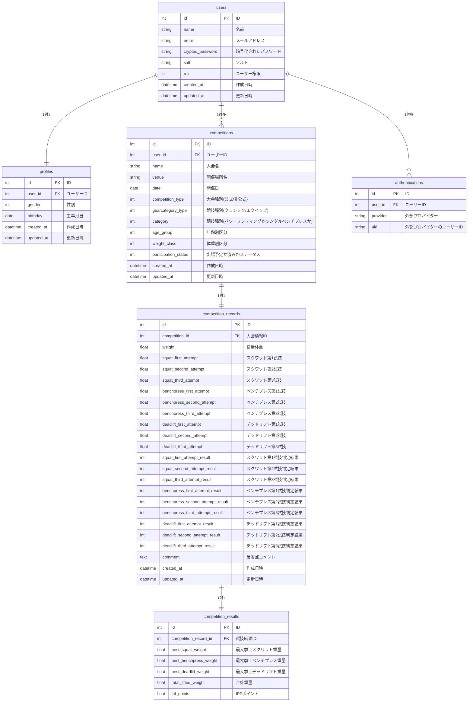

# PowerLifter's Log
## サービスURL： https://www.powerlifterslog.com/

### ■サービス概要
このサービスは、パワーリフティング大会やシングルベンチプレス大会の成績を登録・管理できるツールです。
パワーリフティングは、スクワット、ベンチプレス、デッドリフトの3種目の合計挙上重量で順位を決定する競技です。
シングルベンチプレス大会は、ベンチプレス種目のみで競われ、挙上重量によって順位が決まります。
本サービスでは、ユーザーが大会ごとの成績を登録することで、過去の大会と比較してどれだけ記録が伸びたかを自動で算出できます。また、成績をグラフ化して、成長の推移を視覚的に確認することができます。これにより、競技へのモチベーション向上をサポートします。

### ◾️使い方イメージ
| トップページ | 出場済大会情報一覧 |
|:-----------:|:------------:|
|  |  |
| LINEログインで会員登録・ログインができます。 | ユーザーが登録した出場済大会が一覧で表示されます。 |

 

| 大会情報の登録| 試技結果の登録 |
|:-----------:|:------------:|
|  |  |
| 大会情報の登録画面です。 | 大会の試技結果の入力画面です。 |

 

| 大会情報詳細ページ | 合計重量・IPFGLポイント自動計算 |
|:-----------:|:------------:|
|  |  |
| 登録した大会情報の詳細が確認できます。 | 挙上重量の合計値とIPF GL ポイントを自動計算します。  前回大会比を自動計算します。 |

 

| 成績グラフ化機能 |
|:-----------:|
|  |
| 成績をグラフ化して、成長の推移を視覚的に確認することができます。 |

### ◾️サービスを作成した背景
私は5年間、パワーリフティング競技に取り組み、毎年大会に出場しています。
このサービスを作った背景には、**成績を記録する専用ツールが無い**という課題がありました。

私自身も含め、選手たちは大会結果をSNS、紙のノート、携帯のメモ帳などに記録しています。
しかし、過去の記録を振り返ったり、前回大会からどれくらい成績が増減したかどうか確認したい時に、
検索がしにくいと感じることが多々ありました。
また、今大会の成績と前大会の成績を比較し、
何kg上がったか、下がったかを毎回手動で計算して確認していたため、時間がかかっていました。

上記の課題から、大会の成績を管理し、簡単に比較できるツールがあれば便利だと考え、このツールを開発しました。

### ◾️ユーザー層について
パワーリフティング、シングルベンチプレスの競技者

### ◾️工夫したポイント
#### テーマカラーの選定理由のこだわり
競技用プレートで最も重い25kgプレートが赤色であることから、テーマカラーに赤色を採用しました。
選手たちはこのプレートを「赤盤」と呼び、赤盤を多くつけられることが強さの象徴となります。
**「ついに赤盤◯◯枚で◯◯kgを挙げた！」「次は赤盤◯◯枚を目指したい！」**といったように、
赤盤への思い入れが競技力向上へのモチベーションに繋がります。
そのため、赤色は選手たちの情熱を象徴するカラーとして最適だと考えました。

#### ユーザビリティ向上のため、試技結果の登録フォームをステップ入力フォーム化

試技結果の新規登録フォームを、ステップ入力フォームにしました。
試技結果の入力項目数は、最大20項目になります。最初は1ページにすべてまとめていましたが、
実際のユーザーの使用状況を考え、 実際にその状況下で使ってみたときに使いづらいことがわかりました。
解決策としてステップ入力フォームを実装し、以下のように5ページに分割することにしました。
1. 検量体重フォーム
2. スクワットフォーム
3. ベンチプレスフォーム
4. デッドリフトフォーム
5. コメント入力フォーム

- 各フォームごとに入力データのバリデーションを実行し、成功すれば次のフォームへ遷移します。
失敗した場合はユーザーに再入力を促します。
- 各フォームの段階ではデータベースに保存せず、バリデーションのみを行い、
最後のステップが完了した時点で全てのデータを一括してデータベースに保存します。

これにより、各ステップでデータの正確性を確認しながら、不要な中間データが保存されないようにしています。
これを実現するために、各ステップごとにコントローラとモデルを作成し実装しました。
結果的に入力ミスも減り、実際のユーザーには使いやすい、見やすいと言っていただけました。

### ■ 使用技術
| カテゴリ | 技術 |
| --- | --- |
| 開発環境 | Docker |
| フロントエンド |TailwindCSS, DaisyUI|
| バックエンド | Ruby 3.2.2 / Ruby on Rails 7系 |
| データベース | PostgreSQL |
| インフラ | Render |
| Web API | LINE Messaging API |
| 認証 | Sorcery, LINE認証 |
| CI | GitHub Actions (Rubocop, RSpec)|
| その他 | Chart.js, Rubocop, RSpec|

### ◾️インフラ構成図

- GitHub Actions(CI)
GitHub Actionsを使って、CI環境で自動的にRubocopとRSpecを実行しています。main ブランチにコードがプッシュされた際やプルリクエストが送信された際に、このワークフローがトリガーされ、指定されたチェックが自動で行われます。
RSpecを用いることで、テストを通じてプログラムの動作を確認し、品質を向上させます。一方、Rubocopを使用することで、コードスタイルを統一し、コードの品質や可読性を保ちます。
このプロセスを継続的に実行することで、Webサービスの全体的な品質を常に高い状態に維持することができます。

### ■ 画面遷移図
[Figma: 画面遷移図](https://www.figma.com/file/pGxlFmkWvjxv384P6Ymi9x/Good-Lifter-log?type=design&node-id=0%3A1&mode=design&t=7WateIMFCpHj8mR9-1)

### ■ ER図

